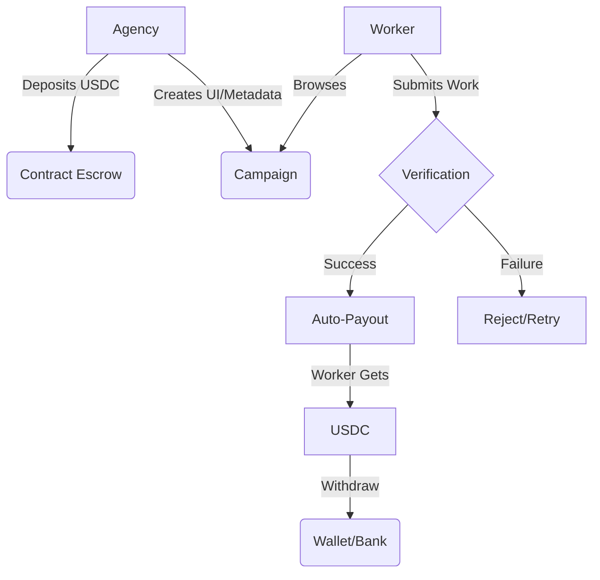

# How It Works

ArcWorker operates as a three-sided marketplace: **Agencies**, **Workers**, and **AI Agents**.

## The Lifecycle of a Campaign

### 1. Creation (The Agency)
An Agency creates a campaign by defining:
*   **Task Type**: NER, Bounding Box, Classification, etc.
*   **Dataset**: The source data to be labeled (images, text).
*   **Reward**: The USDC amount per successful task.
*   **Verification Method**: How the work will be validated.

Funds are deposited into the **TaskEscrow** smart contract.

### 2. Participation (The Worker)
Workers browse the Task Market and select campaigns.
*   Once a task is started, it is "locked" to that worker for a limited duration.
*   The worker submits their result through our specialized labeling interfaces.

### 3. Verification & Payout
The protocol validates the submission:
*   **Auto-Verify**: If the submission matches the "Golden Set" or reaches consensus, the smart contract immediately releases funds to the worker's wallet.
*   **Agency Review**: For manual tasks, the agency reviews and approves/rejects the work in their dashboard.

### 4. Consumption
The Agency receives the finalized, verified data and can export it to their training pipeline via the ArcWorker SDK.

## Technical Flow Diagram

